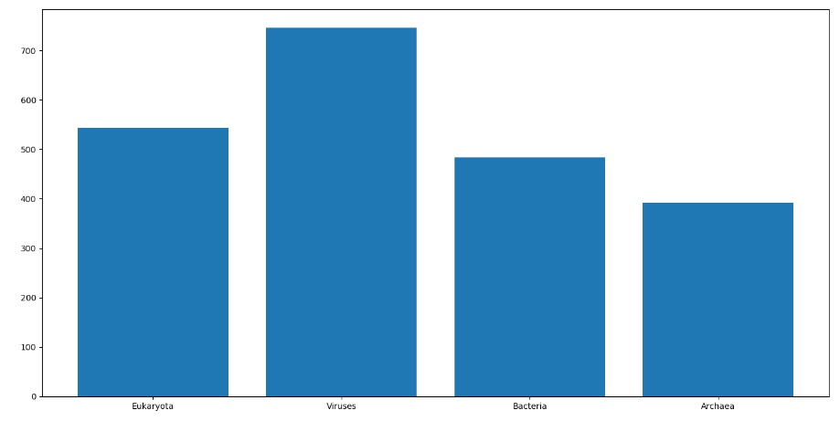

#**CSC1034: Practical 2**

#### This package allows analysis and display of proteins from Uniprot. It has been done as a part of CSC1034 module.

## Language and modules used in the project:
* Python (3.7.4)
* Biopython	(1.74)
* Matplotlib (3.1.1)
* Pytest (5.2.1)
* Pyparsing (2.4.2)

##Launch
This project can be accessed from my Project 2 repository on Gitlab (URL).
To use it, you will need to have Python 3.7.4, Pycharm (or any other IDE) installed on your computer.
To create virtual environment and manage the project, you will need to use pip and pipenv (e.g. `pipenv --python 3.7`).
Once this is done, copy this project to your repository and clone it from there into your IDE.
You will also have to install the required packages and modules. 

##Functionality
This project can be used to access the names of all proteins in a file, see the average length of their sequences,
or to create a bar graph/pie chart of average protein lengths by taxa. To do this, either call a suitable function from 
uniplot.py file in the terminal, or run the file itself after specifying which function to call within it. 
The available functions are as follows:
1) To print the list of protein names use: uniplot.py list
2) To calculate the average length of all proteins use: uniplot.py average
3) To plot a bar chart depicting protein lengths by taxa use: uniplot.py taxa_average_figure
4) To display the whole contents of the file use: uniplot.py dump

E.g. running `pipenv run python uniplot.py plot_average_by_taxa`, in the terminal,
 should display something akin to this: 
 

* The location of the file one want to analyse is configurable so the user can choose which file and
from where they want to analyse. To do this, type to the terminal '--file_location ' followed by the file path, 
BEFORE typing the name of the function you want to run.
(e.g. `python uniplot.py --file location .practical-2\uniprot_receptor.xml.gz\uniprot_receptor.xml average`) 
* The number of levels of taxa you want to plot the figure for can be specified by using '--depth=' argument. 
Type this into the terminal before the function for the figure you want to plot.
(e.g. `python uniplot.py --depth=1 taxa_average_figure`)
* To plot a bar graph, use '-bar' argument in the terminal before the name of the function.
(e.g. `python uniplot.py -bar taxa_average_figure`)
* To plot a pie chart, use -pie argument in the terminal before the name of the function.
(e.g `python uniplot.py -pie taxa_average_figure`)
* For help, type `python uniplot.py -h`

 ##Sources
 This Project is based on an outline and a tutorial 'How Receptive Are You?' by Philip Lord of Newcastle University.
 The tutorial can be accessed here: https://internal.cs.ncl.ac.uk/modules/2019-20/csc1034/part-1/project-2/csc1034-project-2_web.html

